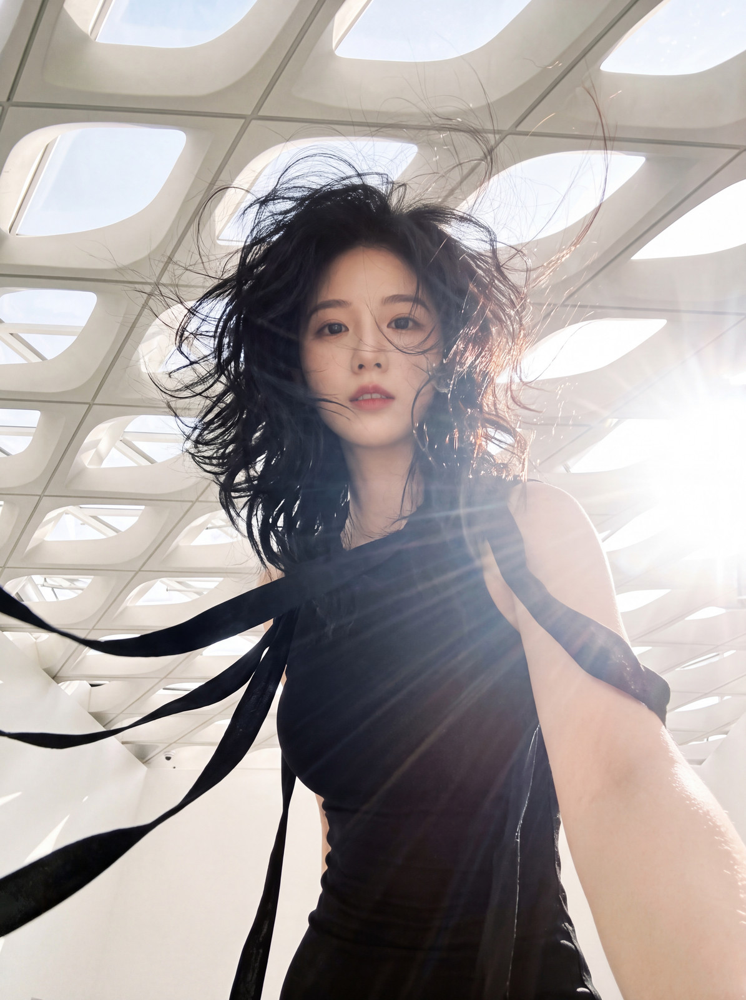
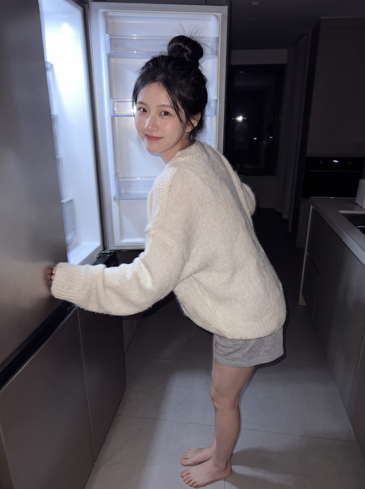
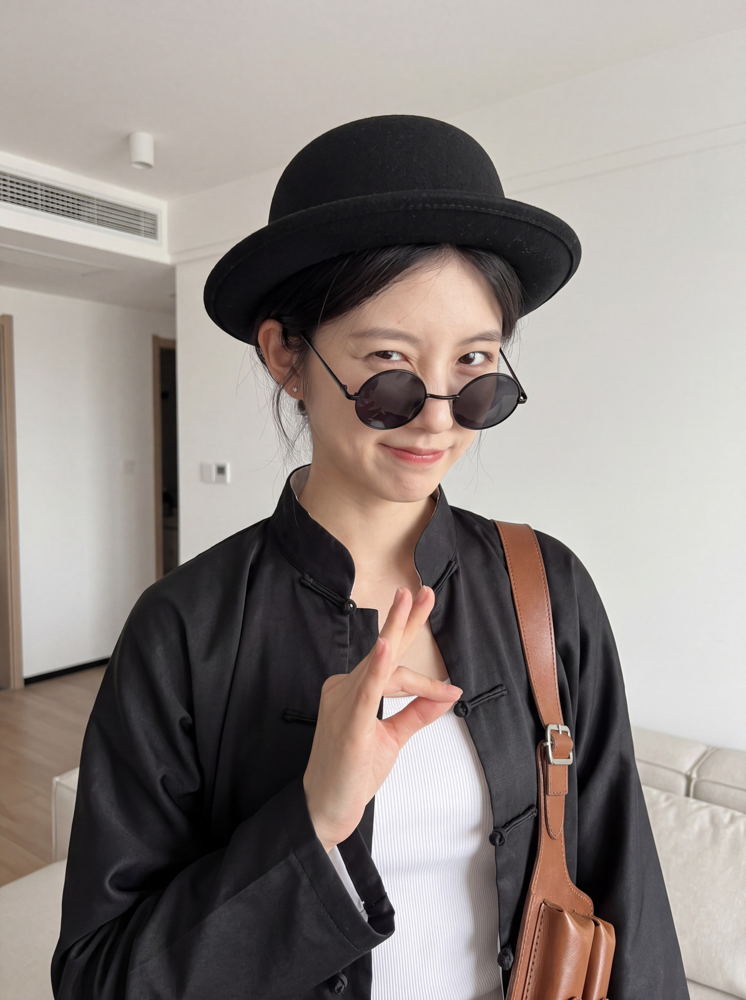
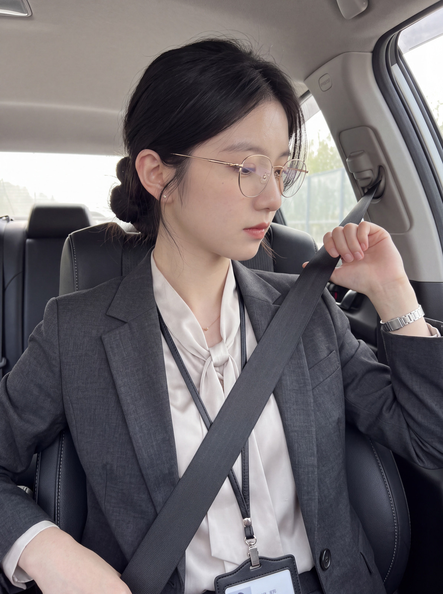
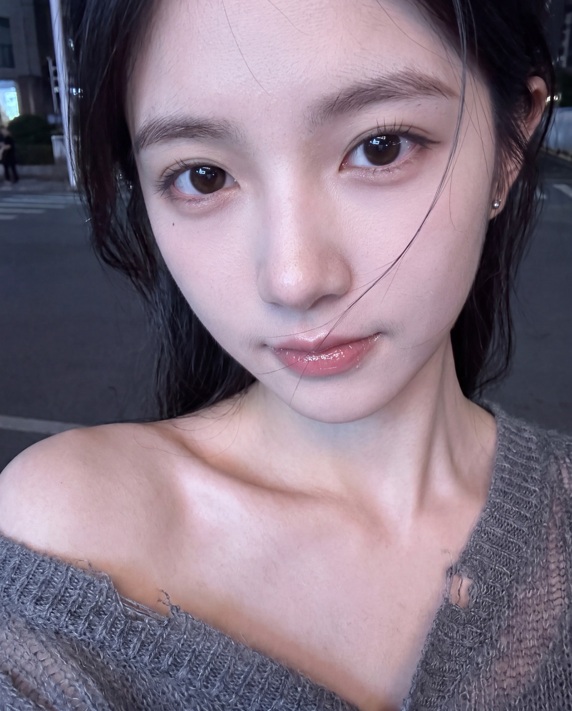
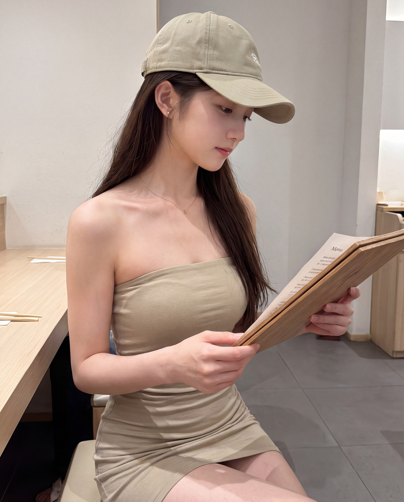
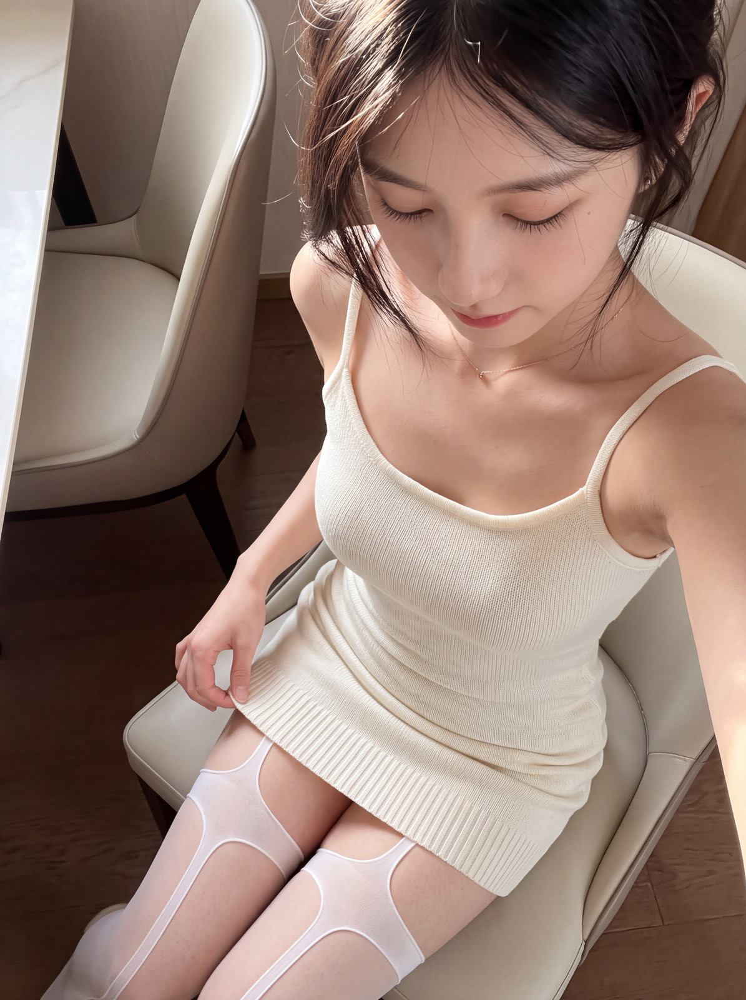
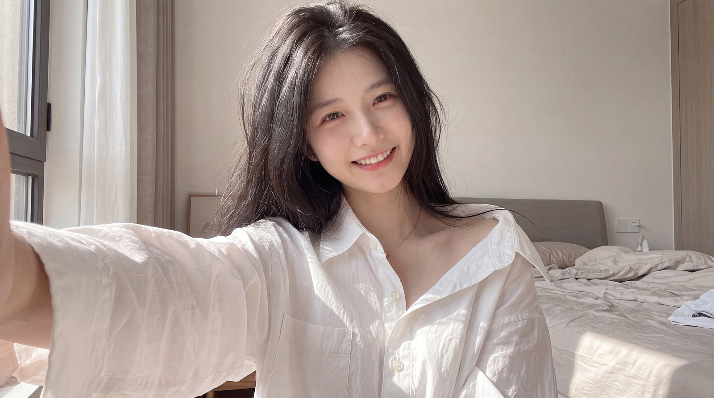

# AstrBot Gitee AI Image

**让 Bot 有自己的形象, 也有每天不一样的生活.**

自拍 · 合影 · 后台生图 · 视频 · 映像工作台

   

[特色功能](#特色功能) · [推荐服务商](#推荐服务商) · [出图展示](#出图展示) · [申请与配置教程](#申请与配置教程) · [更新日志](CHANGELOG.md)

这是一个为 AstrBot 提供 **文生图、改图、固定形象自拍、多人合影和视频生成** 的插件. 你可以直接用自然语言让 Bot 拍照, 也可以在内置的 **映像工作台 WebUI** 中配置服务商、批量创作、整理画廊、排版画布和连接节点工作流.

它不只是把一句提示词转发给模型: Bot 可以保留自己的参考形象, 按当天的穿搭与日程拍照, 在等待图片时继续和你聊天, 或先拍一张自己, 再让照片中的自己动起来.

> **插件开发与交流 QQ 群: `215532038`** · [查看群二维码](#交流与反馈)
>
> 主要维护 `QQ / aiocqhttp`, 同时适配个人微信 `weixin_oc`. 需要 **AstrBot >=4.28.0 且 <5**. 插件支持多个平台接口, 不限于 Gitee; 具体模型能力由所选服务商决定.

## 特色功能

### 01 · 预设 Bot 形象自拍

**本插件的首创设计之一.** 预先保存 Bot 的身份参考图, 聊天时只需说“拍张你在窗边的照片”, 插件就会带着固定身份参考生成新照片. 不必每次重新上传参考图, 也不只是依靠文字猜长相. 支持多套形象, 用 `/换形象 日常` 切换当前会话的 Bot 造型.

[看实际自拍成片](#美年达-gemini-自拍) · [设置自拍与形象库](docs/studio.md#形象库与日程联动)

### 02 · LLM 后台生图, 不阻塞主对话

**本插件的另一项首创设计.** LLM 接下图片任务后立即回到对话, 用户与 Bot 可以继续聊天. 图片在后台生成, Bot 能知道任务进度, 完成或失败后再按当前人格回来回应. 单图、自拍、改图和批量任务都能使用, 不用等一张慢图把整段聊天卡住.

[开启后台生图](docs/background-and-context.md#llm-后台生图)

“首创”是作者对本插件原创设计的定位, 不表示对所有同类项目做过排他性比较.

### 让创作连起来的更多能力

| 特色                            | 可以做什么                                                                                                                                                              |
| ------------------------------- | ----------------------------------------------------------------------------------------------------------------------------------------------------------------------- |
| **03 · Fallback 回退链路**      | 文生图、改图、自拍和视频分别配置主用与备用服务商. 按顺序处理可回退的失败, 不必每次手动切换.                                                                             |
| **04 · WebUI / 画布 / 画廊**    | 获取模型列表、拖动链路、可视化编辑配置; 在画廊看提示词和大图, 在自由画布排版, 用节点工作流保存创作流程.                                                                 |
| **05 · 预设提示词**             | 保存常用文生图、改图和视频提示词, 用“预设名 + 本次要求”调用; 改图预设还可注册成独立中文指令.                                                                            |
| **06 · 他人形象与 Bot 合影**    | 为自己或其他人物建档, 将聊天里的“我”绑定到对应形象. 可以说“我们合照”, 也可以只给“穿西装的我”拍照. 人物身份与穿搭分别约束.                                               |
| **07 · 每天不同的穿搭与场景**   | 联动 [日程与穿搭插件 life_scheduler](https://github.com/muyouzhi6/astrbot_plugin_life_scheduler), 让 Bot 默认穿当天的衣服、置身当天的生活场景. 用户明确要求优先.        |
| **08 · LLM 拍视频**             | “你拍个你跳舞的视频我看看”会先按 Bot 形象生成自拍底图, 再转成视频. 普通图片也可以直接做动画, 没有图片时可文生视频.                                                      |
| **09 · 批量、变体、仿拍与换装** | 从一张成片继续规划多组镜头, 编辑每张提示词, 勾选后批量生成; 失败项单独重试, 已成功图片不重跑.                                                                           |
| **10 · 历史图片与精细控制**     | 联动 [ContextAware](https://github.com/muyouzhi6/astrbot_plugin_context_aware) 引用聊天里的历史图片; 支持比例、精确尺寸、1K/2K/4K、多 Key 轮询、质量参数和无损图片保存. |

形象参考不能保证模型每次都完美保持同一张脸, 内容和分辨率也取决于上游能力. 对无法确认是否创建成功的付费任务, 插件会停止自动重建, 避免“回退”变成重复扣费.

## 推荐服务商

以下推荐结合作者实际使用体验. **免费额度、价格、模型名称和可用分组会变化**, 申请与配置步骤放在后面的教程入口, 首页先看适合自己的方案.

### Gitee AI · 免费文生图入门

**推荐模型: `z-image-turbo`**. 适合先用免费额度体验文生图, 支持最高 2K 的白名单尺寸, 真人写实效果不错. 作者使用及旧版教程记录的额度为 **每天免费 100 张**; 当前账号是否仍享有此额度, 以 Gitee 模型页显示为准.

作者体验中它的内容限制较少, 可生成 NSFW 题材; 这不是托管 API 永久“无审查”的承诺, 平台规则和实际返回可能变化.

> **只支持文生图, 不能进行参考图自拍、改图或身份合影.**
> 只配置此模型时, 不要启用参考图自拍模式. 可以在人设中详细描述成年人物的五官、发型、体态与气质, 让 LLM 每次将描述加入文生图提示词, 实现文字驱动的“伪自拍”; 它不是身份锁定, 不保证每张同脸.

[前往 Gitee 模型页](https://ai.gitee.com/serverless-api?model=z-image-turbo) · [查看 Gitee 出图](#gitee-z-image-turbo-文生图) · [API Key 图文申请与配置](docs/providers.md#gitee-ai)

### 美年达 · 真人自拍与二次元创作

**作者日常使用并推荐的生图站点**, 价格实惠, 出图质量高. 真人写真与固定形象自拍优先试 **Gemini 香蕉系列**, 二次元题材可优先试 **GPT Image 2 / 2.5 系列**. 这是作者的使用偏好, 两个系列都不局限于单一画风.

| 用途                         | 模型与接入建议                                                                                                               |
| ---------------------------- | ---------------------------------------------------------------------------------------------------------------------------- |
| 真人写实、Bot 自拍、日常合影 | `gemini-3.1-flash-image`, 使用 **Gemini 原生** 模板. 下方 10 张 Bot 照片均由作者通过本插件自拍模式生成.                      |
| 二次元、插画、文生图与改图   | `gpt-image-2`, 使用 **OpenAI Images** 模板. `gpt-image-2.5-flare` 等型号按后台支持的接口选择; 部分 2.5 型号仅提供 Chat 接口. |

教程提供 **美年达香蕉** 与 **美年达 GPT Image** 两套独立服务商配置示例, 可分别放入自拍、改图和文生图链路. 支持的模型以账号所选令牌分组和获取模型列表为准, 不要把模型系列名称当作精确模型 ID.

[注册美年达](https://meinianda.top/sign-up?aff=Qs4O) · [查看 Bot 自拍成片](#美年达-gemini-自拍) · [申请 Key 与两套配置示例](docs/providers.md#美年达)

注册链接包含作者 AFF 推荐标识. 价格与模型可用性以站点实时计费页为准.

### Agnes AI · 限时免费视频

**推荐模型: `agnes-video-2.5-flash`**. 到 [platform.agnes-ai.com](https://platform.agnes-ai.com/) 注册并创建 API Key, 即可通过本插件调用. 截至 2026-09-16, [官方文档](https://wiki.agnes-ai.com/en/docs/agnes-video-25-flash) 标明限时免费, 当前价格为 **`$0/second`**.

支持文生视频、首尾帧与图片/音频参考, **4 至 12 秒, 720P**. 插件按 `RPM=1` 设置至少 61 秒的请求间隔, 创建和查询共用限速. 同时配置一个支持改图的图片服务商, 就能完成“先自拍, 再转视频”.

[注册 Agnes](https://platform.agnes-ai.com/) · [申请与视频配置](docs/video.md#agnes-注册与配置) · [配置 Bot 自拍转视频](docs/video.md#先自拍再转视频)

免费活动并非永久或无限额度; 自拍底图仍由图片服务商计费. 平台注册地址不等于 API 地址, 配置时填写 `https://apihub.agnes-ai.com/v1`.

## 出图展示

### 美年达 Gemini 自拍

**模型 `gemini-3.1-flash-image` · 美年达站点 · 本插件自拍模式**

以下为作者提供的 10 张 Bot 生成照片. 从日常穿搭、室内光线到不同视角, 展示固定形象参考下的实际创作结果. 展示图仅做等比缩小和体积优化, 不裁切、不修脸, 不携带原文件 EXIF; 点击图片查看较大预览.

<table>
  <tr>
    <td width="50%"></td>
    <td width="50%"></td>
  </tr>
  <tr><td align="center">逆光与细节</td><td align="center">日常与穿搭</td></tr>
  <tr>
    <td width="50%"></td>
    <td width="50%"></td>
  </tr>
  <tr><td align="center">造型与表情</td><td align="center">场景与叙事</td></tr>
</table>

<strong>展开其余 6 张自拍</strong>

<table>
  <tr>
    <td width="50%"></td>
    <td width="50%"></td>
  </tr>
  <tr>
    <td width="50%"></td>
    <td width="50%"></td>
  </tr>
</table>

[使用同款模型与配置](docs/providers.md#美年达香蕉配置) · [设置自己的 Bot 形象](docs/studio.md#形象库与日程联动)

### Gitee Z-Image-Turbo 文生图

**模型 `z-image-turbo` · Gitee AI · 纯文字生成**

保留早期 README 的三张实际出图. 这组展示说明的是 Gitee 的真人文生图效果, **不是参考图自拍**, 也不代表支持图像编辑或固定身份.

<table>
  <tr>
    <td width="33%"></td>
    <td width="33%"></td>
    <td width="33%"></td>
  </tr>
</table>

[申请免费额度与 API Key](docs/providers.md#gitee-ai) · [文字伪自拍说明](docs/providers.md#gitee-文字伪自拍)

## 申请与配置教程

**第一次使用**: 在 AstrBot 插件市场搜索 `astrbot_plugin_gitee_aiimg`, 或按仓库链接安装. 然后按以下顺序设置: **添加服务商 → 保存 Key 与模型 → 加入对应功能链路 → 测试出图**. 想让 Bot 保持固定形象, 再设置身份参考与自拍链路.

| 按需阅读                                               | 内容                                                                |
| ------------------------------------------------------ | ------------------------------------------------------------------- |
| [Gitee 图文申请教程](docs/providers.md#gitee-ai)       | 找回旧版 API Key 截图、免费额度截图, 配置 2K 文生图与文字伪自拍     |
| [美年达申请与配置](docs/providers.md#美年达)           | 创建令牌、选择分组, 香蕉与 GPT Image 两套独立配置, 2.5 系列接口区别 |
| [Agnes 免费活动与配置](docs/video.md#agnes-注册与配置) | 注册、API Key、模型 ID、完整配置片段及 `RPM=1`                      |
| [Bot 自拍转视频](docs/video.md#先自拍再转视频)         | 自拍和视频双链路、日程穿搭、开关与工具参数                          |
| [映像工作台指南](docs/studio.md)                       | WebUI、服务商、画廊、批量创作、自由画布与节点工作流                 |
| [后台生图与历史图片](docs/background-and-context.md)   | 不阻塞对话、任务状态、ContextAware 图片引用与会话隔离               |
| [配置与命令参考](docs/configuration.md)                | 中文指令、预设提示词、尺寸、quality、并发、编码、平台限制与常见问题 |
| [其他接口配置](docs/providers.md#其他接口)             | OpenAI Images / Chat、Gemini 原生、即梦等模板                       |
| [更新日志](CHANGELOG.md)                               | 版本变化与升级说明                                                  |

### 配套插件

- [日程与穿搭 · astrbot_plugin_life_scheduler](https://github.com/muyouzhi6/astrbot_plugin_life_scheduler): 提供每天的穿搭、生活场景与日程. 本插件只读取已缓存的当天状态, 不会为了拍照擅自重新生成日程.
- [聊天上下文 · astrbot_plugin_context_aware](https://github.com/muyouzhi6/astrbot_plugin_context_aware): 引用当前会话中的历史图片, 继续编辑或合影, 不必反复重新发图.

### 使用前了解

模型是否支持改图、多人物、有序参考图和目标分辨率, 以对应服务商为准. **Gitee `z-image-turbo` 只能文生图**, 不要放进自拍或改图链路. 工作台目前管理图片, 节点工作流不支持 ComfyUI 导入、第三方节点或视频节点. 视频通过指令或 LLM 工具调用.

`v5` 沿用 `v4` 配置结构, 从 `v3 / v2` 升级需重新核对配置. 3365 和 SD2.0 专用模板已移除, 请清理旧服务商及链路引用. 升级前备份插件配置与数据目录, 尤其是形象参考和 `studio/` 资产.

## 交流与反馈

**插件开发 QQ 群: `215532038`**. 欢迎交流配置、分享成片和反馈问题. 报错时附插件版本、所用模型、接口模板与脱敏日志, 不要公开 API Key 或未授权的人物参考图.

  

[提交问题](https://github.com/muyouzhi6/astrbot_plugin_gitee_aiimg/issues) · [查看源码](https://github.com/muyouzhi6/astrbot_plugin_gitee_aiimg) · [回到顶部](#astrbot-gitee-ai-image)

