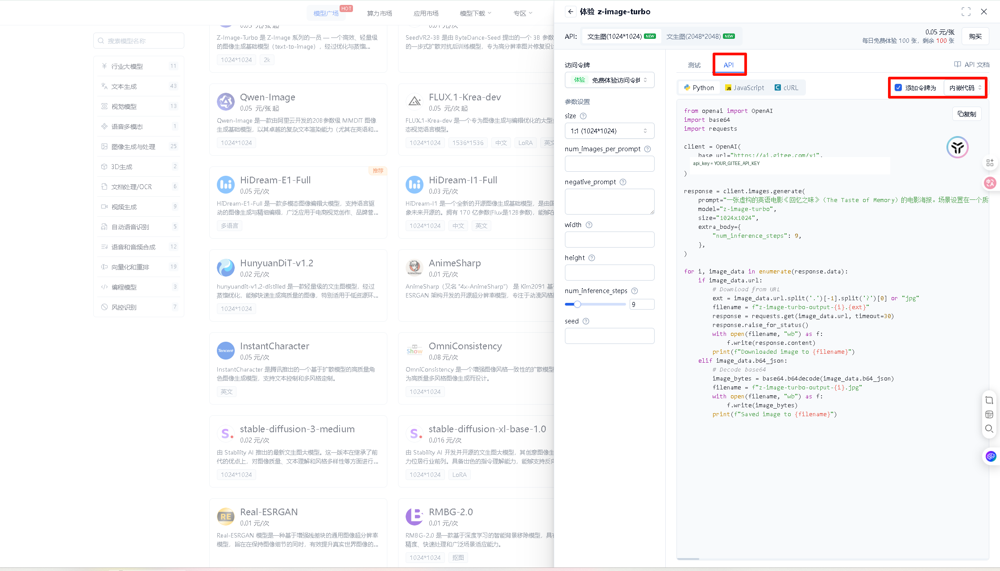
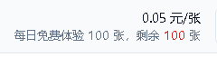

# 服务商申请与配置

[返回插件首页](../README.md) · [出图展示](../README.md#出图展示) · [工作台配置界面](studio.md#模型连接与回退链路) · [完整参数参考](configuration.md)

## 先分清两件事

**服务商 `providers` 定义“接哪一个模型”, 功能链路 `features.*.chain` 定义“哪项功能使用它”.** 只填 Key 而不加入链路, 不会成为该功能的默认服务商.

1. 在映像工作台的 **服务商 > 模型连接** 添加模板, 填写地址、Key 和模型.
2. 获取并选择模型, 或手动填写平台给出的精确模型 ID, 点击 **保存并生效**.
3. 在 **回退链路** 将服务商加入文生图、改图、自拍或视频, 排序后保存.
4. 发一条对应指令测试. 临时指定服务商用 `@服务商ID`, 不会更改默认链路.

下方 JSON 是**插件配置片段**, 不是上游 API 请求体. 将 provider 追加到现有 `providers`, 将对应功能合并到 `features`; 不要整段覆盖已有模型、参考图或其它功能. 示例中的 `YOUR_..._API_KEY` 都是占位符.

## Gitee AI

**适用: 免费额度入门、纯文生图、最高 2K. 不适用: 改图、参考图自拍、多人物身份合成.**

### 申请 API Key

1. 打开 [Gitee AI 的 z-image-turbo 模型页](https://ai.gitee.com/serverless-api?model=z-image-turbo), 注册或登录账号.
2. 选择 `z-image-turbo` 的体验/API 页面, 查看当前账号的每日免费额度和可用尺寸.
3. 在 **API** 页选择访问令牌; 旧版界面可勾选“添加令牌为内嵌代码”, 在示例中的 `api_key` 位置取得令牌. 当前页面若改为独立的令牌管理入口, 按页面提示创建 Key.
4. 只把自己的 Key 填入插件, 不公开示例中的真实令牌或带 Key 的截图.



旧版 README 的免费额度截图:



这两张截图恢复自早期仓库教程, 原截图时间为 2025-12-05, 用于说明操作位置和当时的 **每日 100 张** 额度. 平台界面、账号资格及免费尺寸档位可能变化, 申请时以当前页面为准; **模型支持 2K 不等于 2K 一定包含在免费额度内**.

### 配置 2K 文生图

选择 **Gitee 图** 模板, 模型填写 `z-image-turbo`, Base URL 填写 `https://ai.gitee.com/v1`. 以下示例使用竖幅 `1536x2048`, `num_inference_steps=9`.

```json
{
  "providers": [
    {
      "__template_key": "gitee_images",
      "id": "gitee_zimage",
      "label": "Gitee Z-Image-Turbo",
      "base_url": "https://ai.gitee.com/v1",
      "api_keys": ["YOUR_GITEE_API_KEY"],
      "model": "z-image-turbo",
      "default_size": "1536x2048",
      "num_inference_steps": 9,
      "timeout": 600,
      "max_retries": 2,
      "output_format": "jpeg",
      "extra_body": {}
    }
  ],
  "features": {
    "draw": {
      "enabled": true,
      "llm_tool_enabled": true,
      "chain": [
        {
          "__template_key": "provider",
          "provider_id": "gitee_zimage",
          "output": "1536x2048"
        }
      ]
    }
  }
}
```

测试指令:

```text
/aiimg @gitee_zimage 一位成年女性站在窗边, 自然日光, 真实摄影 3:4
```

可用尺寸见 [Gitee 尺寸表](configuration.md#gitee-支持的图像尺寸). `z-image-turbo` 只加入 **文生图链路**, 不加入改图或自拍链路. Gitee 平台的其它改图模型是另外的能力, 不能因为平台相同就认为这个模型也能改图.

### Gitee 文字伪自拍

只配置 Gitee `z-image-turbo` 时, 关闭参考图自拍开关, 避免 LLM 为纯文生图模型调用自拍编辑流程. 已配置其它改图服务商的用户, 不需要把整个插件的自拍功能关闭, 只需确保自拍链路不包含这个模型.

```json
{
  "features": {
    "selfie": {
      "enabled": false,
      "llm_tool_enabled": false
    }
  }
}
```

在人设中保存明确的成年人物外貌描述, 并约定请求照片时使用文生图模式, 例如:

```text
你的视觉形象是一位 26 岁成年女性, 黑色及肩短发, 棕色眼睛,
鹅蛋脸, 自然肤质, 身材匀称. 每次生成自己的照片时,
将这些外貌特征完整加入图片提示词, 再补上本次的服装、动作和场景.
当前服务商只支持文字生成, 调用 aiimg_generate 时使用 mode=text,
backend=gitee_zimage, 不使用自拍参考图或图像编辑模式.
```

这能让画面风格和外貌描述相近, 但没有人脸参考约束, 不能保证同一身份. 需要可靠得多的身份保持、合影或自拍视频时, 配置支持参考图编辑的模型, 如下方美年达香蕉.

[查看 Gitee 出图](../README.md#gitee-z-image-turbo-文生图)

## 美年达

[注册美年达](https://meinianda.top/sign-up?aff=Qs4O) · [公开模型与价格页](https://meinianda.top/pricing) · [查看本插件自拍成片](../README.md#美年达-gemini-自拍)

注册链接带作者 AFF 标识. 作者推荐香蕉系列用于真人写实, GPT Image 系列用于二次元与插画; 具体价格按所选模型、分组和站点计费规则计算, 不在这里固定一个可能过期的单张价格.

### 申请令牌与选择分组

1. 注册并登录美年达, 在令牌/API Key 管理中创建供插件使用的令牌.
2. 选择包含目标模型的分组, 确认账号余额、模型权限和模型限制. 不同分组的价格与可用模型可能不同.
3. 将 Key 填入插件的 **API Key 池**, 在模型连接中获取列表并搜索目标模型. 获取不到时, 按当前分组页面填写精确模型 ID.
4. 香蕉和 GPT Image 分别创建服务商连接, 不把一个连接的协议随模型名称一起混用.

以下两套“专用配置”复用插件已有的通用协议模板, 不是新增的协议或必须安装的扩展. 服务商 ID 和显示名称可以自行修改, 修改后同步更新链路引用.

### 美年达香蕉配置

选择 **Gemini 原生** 模板, 使用 `generateContent` 协议. 示例模型为 `gemini-3.1-flash-image`, 与首页展示的作者自拍所用模型一致.

```json
{
  "__template_key": "gemini_native",
  "id": "meinianda_banana",
  "label": "美年达香蕉",
  "api_url": "https://meinianda.top",
  "api_keys": ["YOUR_MEINIANDA_API_KEY"],
  "model": "gemini-3.1-flash-image",
  "default_resolution": "4K",
  "timeout": 600,
  "max_retries": 2,
  "use_proxy": false,
  "proxy_url": "",
  "output_format": "webp_lossless",
  "extra_body": {}
}
```

不要只因为模型名含 Gemini 就选 Chat 出图协议. 此配置使用原生 `generationConfig.imageConfig` 传递画幅和分辨率, 适合参考图自拍与多人合影. `webp_lossless` 是本地无损编码, 不会降低像素分辨率.

### 美年达 GPT Image 配置

选择 **OpenAI Images** 模板. 示例以明确支持生成和编辑接口的 `gpt-image-2` 为起点:

```json
{
  "__template_key": "openai_images",
  "id": "meinianda_gpt_image",
  "label": "美年达 GPT Image",
  "base_url": "https://meinianda.top/v1",
  "api_keys": ["YOUR_MEINIANDA_API_KEY"],
  "model": "gpt-image-2",
  "supports_edit": true,
  "timeout": 600,
  "max_retries": 0,
  "default_size": "",
  "output_format": "webp_lossless",
  "extra_body": {}
}
```

需要设置质量时, 在额外请求体添加该型号支持的值, 如 `{"quality":"high"}`. `quality` 的值是字符串, 但 `max` 不代表所有模型都支持的最高档; 不支持的值可能被拒绝或忽略, 以模型文档和实际响应为准.

截至 2026-09-16, 公开模型目录中的接口区别如下; 它说明接入方式, 不代表当前 Key 一定有权调用所有型号:

| 精确模型 ID                                            | 公开目录中的接口               | 插件选择                                 |
| ------------------------------------------------------ | ------------------------------ | ---------------------------------------- |
| `gpt-image-2`                                          | Images 生成、Images 编辑、Chat | 优先 `openai_images`                     |
| `gpt-image-2.5-flare`                                  | Images 生成、Images 编辑、Chat | 可用 `openai_images`, 按分组确认参数     |
| `gpt-image-2.5-sunburst`                               | Chat                           | 使用 `openai_chat`                       |
| `gpt-image-2.5-flare-1K` / `gpt-image-2.5-sunburst-1K` | Chat                           | 使用 `openai_chat`, 遵守型号的分辨率限制 |

因此不要把 `gpt-image-2.5` 系列统统复制成 OpenAI Images 配置, 也不要给名称含 `1K` 的型号强填 `4K`. Chat 接口的质量参数和嵌套位置也可能与 Images 接口不同.

### 加入文生图与自拍链路

先添加上面两个 provider, 再合并下面的功能片段. 此示例用 GPT Image 主作文生图, 香蕉主作改图与自拍. 链路顺序可在 WebUI 拖动调整.

```json
{
  "features": {
    "draw": {
      "enabled": true,
      "chain": [
        {
          "__template_key": "provider",
          "provider_id": "meinianda_gpt_image",
          "output": ""
        },
        {
          "__template_key": "provider",
          "provider_id": "meinianda_banana",
          "output": ""
        }
      ]
    },
    "edit": {
      "enabled": true,
      "chain": [
        {
          "__template_key": "provider",
          "provider_id": "meinianda_banana",
          "output": ""
        },
        {
          "__template_key": "provider",
          "provider_id": "meinianda_gpt_image",
          "output": ""
        }
      ]
    },
    "selfie": {
      "enabled": true,
      "llm_tool_enabled": true,
      "default_aspect_ratio": "3:4",
      "chain": [
        {
          "__template_key": "provider",
          "provider_id": "meinianda_banana",
          "output": "4K"
        }
      ],
      "use_edit_chain_when_empty": true
    }
  }
}
```

自拍还需要在 [形象库](studio.md#形象库与日程联动) 绑定 Bot 身份参考, 或用 [自拍参考指令](configuration.md#自拍参考照) 保存图片. 只配置模型不会自动知道 Bot 长什么样.

```text
/aiimg @meinianda_gpt_image 成年女性角色设定, 二次元插画, 干净背景
/自拍 @meinianda_banana 在窗边看书, 自然光, 3:4
```

`use_edit_chain_when_empty=true` 也会把改图链追加为自拍后备, 按 ID 去重; 不希望自拍切换到其它模型时设为 `false`. 多人物能力和画幅必须由所选模型支持, 不能通过增加一个参数凭空获得.

## Agnes 视频

1. 在 [Agnes 平台](https://platform.agnes-ai.com/) 注册账号.
2. 在平台创建 API Key, 确认当前限时免费活动与账号限流.
3. 选择插件 **Agnes 视频** 模板, API 地址填写 `https://apihub.agnes-ai.com/v1`, 模型填写 `agnes-video-2.5-flash`.
4. 加入视频链路并打开视频和 LLM 视频开关. `RPM=1` 时保持请求间隔至少 61 秒.

完整配置、参数限制与实用示例见 [Agnes 视频教程](video.md#agnes-注册与配置). Bot 本人视频还需要上面的图片服务商与身份参考, 见 [先自拍再转视频](video.md#先自拍再转视频).

## 其他接口

本插件不绑定推荐站点. 可用的通用入口包括 OpenAI Images、Gemini 原生、Chat 出图、完整 URL、Gitee 异步改图、Flow2API 和其它已适配后端. 按 [接口模板速查](configuration.md#接口模板速查) 选择, 地址、模型和 Key 以自己的服务商为准.

### 即梦配置

即梦模板使用 Cookie 与 `conversation_id`, 不是 OpenAI Key. 在浏览器登录 [即梦 AI](https://jimeng.jianying.com/), 从会话地址取得 `conversation_id`, 从自己的网络请求中取得 Cookie. Cookie 会过期, 不要公开或共享.

```json
{
  "__template_key": "jimeng",
  "id": "jimeng_1",
  "label": "即梦",
  "cookie_list": ["YOUR_CONVERSATION_ID:YOUR_COOKIE"],
  "timeout": 600
}
```

### 云智配置

原文中的云智接入示例保留在此, 不影响其它服务商. [站点入口](https://ai.beimo.cc/register?aff=9FDGT62B49SM) 带原有 AFF 标识, 当前地址、价格和模型可用性请在站点核对.

```json
{
  "__template_key": "openai_images",
  "id": "yzcld_gpt_image_2",
  "label": "云智 AI GPT Image",
  "base_url": "https://www.yzcld.com",
  "api_keys": ["YOUR_YUNZHI_API_KEY"],
  "model": "gpt-image-2",
  "supports_edit": true,
  "timeout": 600,
  "max_retries": 0,
  "default_size": "",
  "extra_body": {}
}
```

添加后将 `yzcld_gpt_image_2` 加入需要的功能链路. 用自拍或合影前先确认该渠道的编辑及多图能力.
