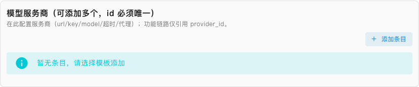
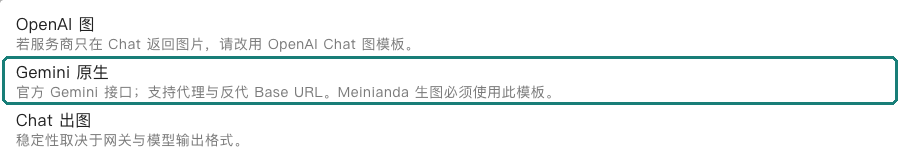
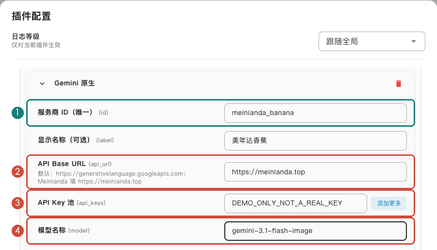
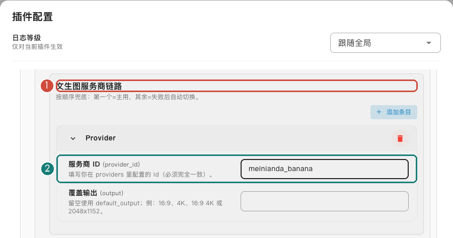
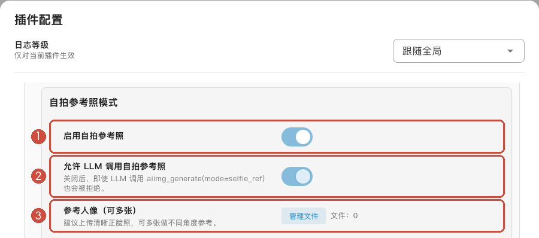
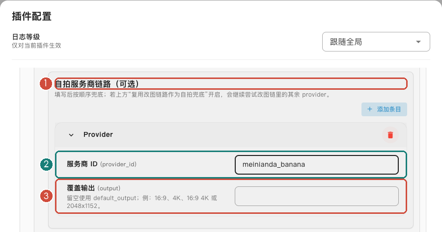
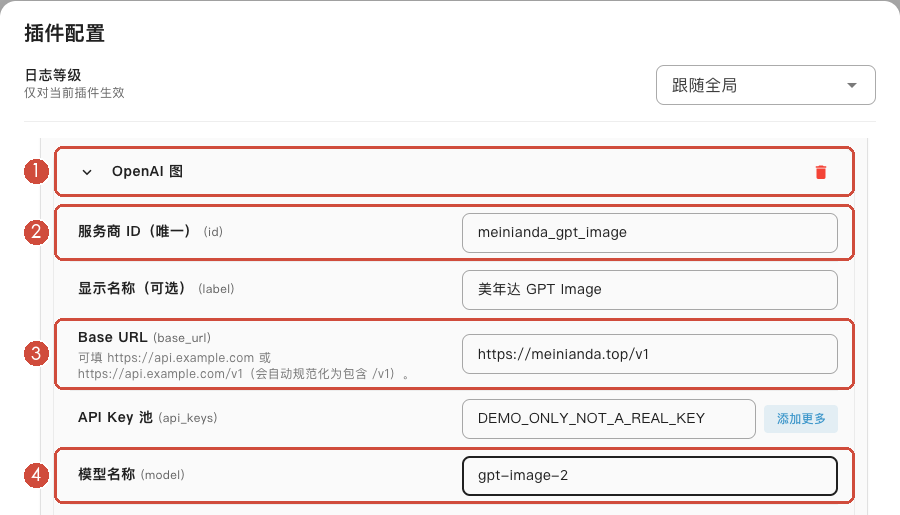
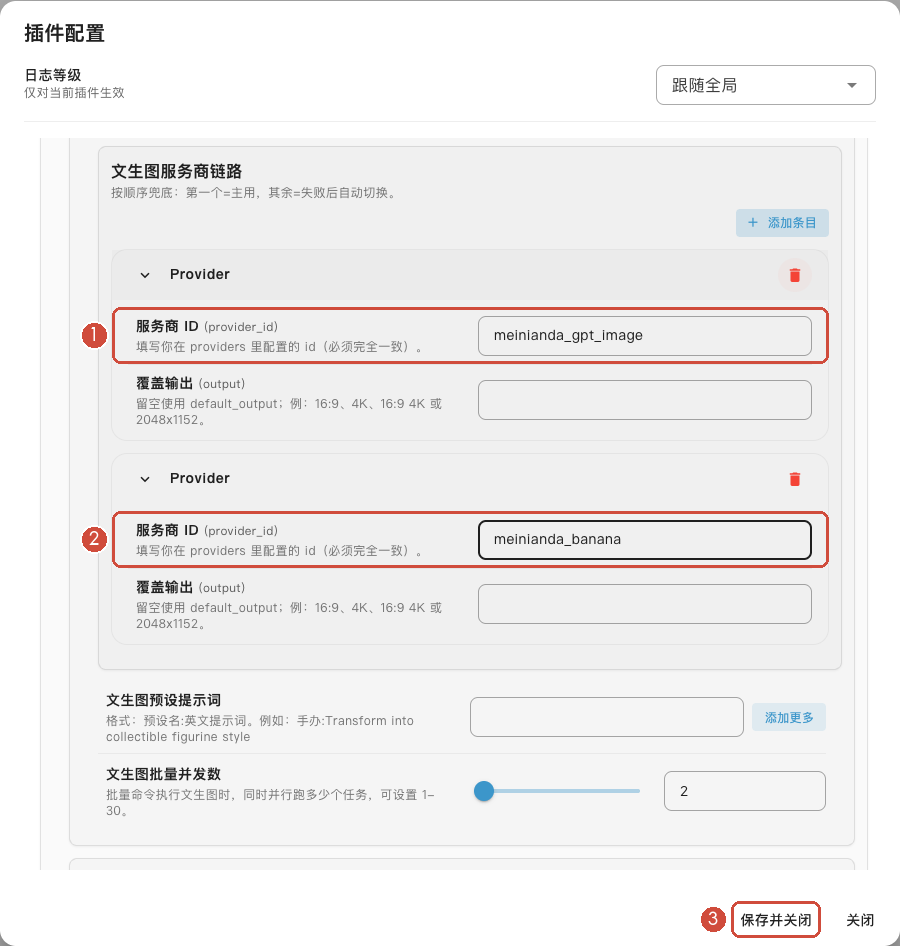

# 跟着截图配置: 美年达入门

[返回插件首页](../README.md) · [申请美年达 Key](providers.md#申请令牌与选择分组) · [完整参数参考](configuration.md)

**先只配一个香蕉模型, 让文生图、改图和 Bot 自拍都能用.** GPT Image 和备用模型放在最后, 不需要现在就看.

记住两件事: **先把模型添加进来, 再告诉每个功能用这个模型.** 全程在 AstrBot 的插件配置里操作, 不需要打开映像工作台, 也不需要编辑 JSON.

截图在本地使用 AstrBot 原生配置组件和演示数据制作, 不含真实 Key 或个人配置. 点击图片可放大.

## 第 1 步: 打开配置, 添加模板

先准备好 [美年达 API Key](providers.md#申请令牌与选择分组), 确认令牌所在分组支持 `gemini-3.1-flash-image`.

在 AstrBot **插件管理** 找到 `astrbot_plugin_gitee_aiimg`, 点 **配置**. 把配置窗口内部滚到最底部, 找到 **模型服务商**, 点右侧 **添加条目**.

[](assets/tutorials/native-config-00-add-provider.png)

弹出列表后, 选 **Gemini 原生**. 不要选下面的“Gemini 图”或“Gemini Chat”.

[](assets/tutorials/native-config-00-template.png)

## 第 2 步: 填好这四项

[](assets/tutorials/native-config-01-banana.png)

1. **服务商 ID** 填 `meinianda_banana`.
2. **API Base URL** 填 `https://meinianda.top`.
3. **API Key 池** 填你自己的美年达 Key, 不要填图中的演示文字.
4. **模型名称** 填 `gemini-3.1-flash-image`.

**显示名称** 可以填 `美年达香蕉`, 其他项先保持默认. 不要离开配置窗口, 接着往下做.

> **第 1 项是你给这个连接起的 ID, 第 4 项才是平台的模型名.** 下面给功能选模型时, 填第 1 项的 `meinianda_banana`.

## 第 3 步: 让文生图和改图使用它

把配置窗口内部往上滚, 找到 **文生图 (Text-to-Image)**.

1. 打开 **启用文生图** 和 **允许 LLM 调用文生图**.
2. 找到 **文生图服务商链路**, 点 **添加条目 → Provider**.
3. 在新增条目的 **服务商 ID** 填 `meinianda_banana`. **覆盖输出** 留空.

[](assets/tutorials/native-config-06-draw-banana.png)

再往下找到 **图生图/改图 (Image-to-Image/Edit)**, 同样打开两个开关, 在 **改图服务商链路** 点 **添加条目 → Provider**, 也填 `meinianda_banana`.

**不用再填一遍 Key. 这两处都是在使用第 2 步已经添加好的模型.**

## 第 4 步: 给 Bot 设置自拍形象

继续往下找到 **自拍参考照模式**:

1. 打开 **启用自拍参考照**.
2. 打开 **允许 LLM 调用自拍参考照**. 这样才能用聊天的方式让 Bot 拍照.
3. 在 **参考人像** 点 **管理文件**, 上传一张清晰的 Bot 形象参考图.

[](assets/tutorials/native-config-05-selfie-settings.png)

在这个模式下继续找到 **自拍服务商链路**, 点 **添加条目 → Provider**, **服务商 ID** 仍填 `meinianda_banana`, **覆盖输出** 留空.

[](assets/tutorials/native-config-03-selfie-chain.png)

**前后两个绿色框填一样的内容, 就连上了.** 不是填“美年达香蕉”, 也不是填模型名.

## 第 5 步: 保存, 试一张

点配置窗口底部的 **保存并关闭**. 再次打开配置, 确认刚才填写的内容还在.

给 Bot 发这条消息, 测试普通生图:

```text
/aiimg 一片湖面, 清晨薄雾, 真实摄影
```

收到图片后, 再测试 Bot 自拍:

```text
/自拍 在窗边微笑, 自然日光
```

改图测试: **附带一张图片**, 发送 `/aiedit 把背景改成海边`.

没有在配置页上传参考图的话, 也可以 **附带 Bot 形象图** 发送 `/自拍参考 设置`, 再测试自拍.

## 让 Bot 一次拍一组照片

前面的自拍测试通过后, 直接对 Bot 说:

> 给我拍 4 张你在窗边的照片, 同一套衣服, 每张换一个姿势、表情和机位.

这是 **LLM 批量出图**: Bot 调用批量工具, 先规划不同镜头, 共用身份参考, 再逐张生成. 不需要你手动写四遍提示词.

- 数量不写时默认 4 张. **批量图片任务 → 单次批量最大张数** 默认 8, 可设置 1-32.
- 想在等照片时继续聊天, 开启 [LLM 后台生图](background-and-context.md#llm-后台生图).
- 对话模型需支持工具调用. 若 Bot 只说话不生成, 检查 AstrBot 是否允许当前人格使用 `aiimg_batch_generate`, 以及改图/自拍的 **允许 LLM 调用** 是否开启.

`/批量4 自拍 ...` 也能一次出多张, 但按同一段要求提交. **想让 Bot 自动规划不同姿势, 用上面的自然语言说法.**

## 可选: 加一个 GPT Image 模型

已经能出图后, 再考虑给文生图换用 GPT Image. 在最底部 **模型服务商 → 添加条目** 选择 **OpenAI 图**.

**美年达的 GPT Image 全系列都用这个模板**, 包括 `gpt-image-2`、`gpt-image-2.5-flare`、`gpt-image-2.5-sunburst`, 不选 Chat 出图.

[](assets/tutorials/native-config-02-gpt-image.png)

| 界面里的字段 | 填什么                                             |
| ------------ | -------------------------------------------------- |
| 服务商 ID    | `meinianda_gpt_image`, 不要和香蕉重复              |
| Base URL     | `https://meinianda.top/v1`                         |
| API Key 池   | 你自己的美年达 Key                                 |
| 模型名称     | 示例为 `gpt-image-2`, 按令牌分组支持的实际模型填写 |

回到 **文生图服务商链路**, 把原来第一项的 ID 改为 `meinianda_gpt_image`. 再添加一个 `Provider`, 第二项填 `meinianda_banana`.

[](assets/tutorials/native-config-04-draw-chain.png)

现在文生图先用 GPT Image, 遇到可回退的失败再试香蕉. 自拍和改图仍用香蕉, 不用改. 最后点 **保存并关闭**.

视频需要另配 [视频服务商](video.md#agnes-注册与配置), 不要把这两个图片模型填到视频里.

## 没出图, 先看这里

| 现象                                  | 先检查什么                                                          |
| ------------------------------------- | ------------------------------------------------------------------- |
| 填了 Key, 还是提示没有可用服务商      | 是否完成第 3、4 步, 给对应功能添加了条目? ID 是否和第 2 步完全一样? |
| 普通生图正常, 自拍失败                | 是否设置 Bot 参考图? 是否打开自拍开关? 自拍的 ID 是否填对?          |
| `/自拍` 能用, 聊天让 Bot 拍照却没反应 | 是否开启对应的“允许 LLM 调用”? 对话模型和当前人格是否允许图片工具?  |
| 提示模型不存在或没有权限              | 模型名是否属于这枚 Key 的分组? 美年达账号余额和模型权限是否正常?    |

[返回插件首页](../README.md) · [质量、尺寸与其他参数](configuration.md)
